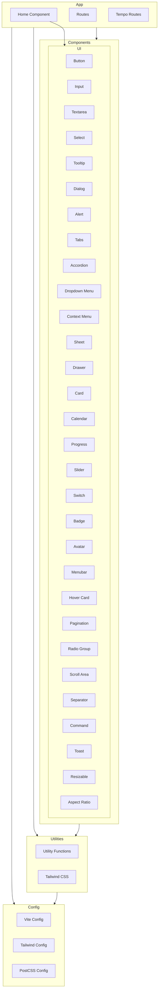

    

    <b>Automatic Architecture Diagrams from Code</b> 
    <a href="https://github.com/swark-io/swark">GitHub</a> • <a href="https://swark.io">Website</a> • <a href="mailto:contact@swark.io">Contact Us</a>

## Usage Instructions

1. **Render the Diagram**: Use the links below to open it in Mermaid Live Editor, or install the [Mermaid Support](https://marketplace.visualstudio.com/items?itemName=bierner.markdown-mermaid) extension.
2. **Recommended Model**: If available for you, use `claude-3.5-sonnet` [language model](vscode://settings/swark.languageModel). It can process more files and generates better diagrams.
3. **Iterate for Best Results**: Language models are non-deterministic. Generate the diagram multiple times and choose the best result.

## Generated Content
**Model**: GPT-4o - [Change Model](vscode://settings/swark.languageModel)  
**Mermaid Live Editor**: [View](https://mermaid.live/view#pako:eNp1VM1u2zAMfhVB5_YFchiQptjaw4AgSXehe2BsxhEgS4ZMN-uKvvv0Y0v2il3Ijx8piqJEfcjaNiQ3sjKtw_4qTo-VEWIYz8nc9n2whXiyHUEQYme73hoy_Jo8BzsyDZDUxJ3Ix0yOiMXCTaapzGqXnHJIy7Pj5TkRQjyMzNZAUq8z-2z6kSHKzJ3oN6MjhBlkz5E01QxJlXhrNaseJp35R4XatpBUZreaHEOUJQOe_TG9KFF1bV2jfMEZlbzO9o29mZ9kRpgNEawcsrOGffExYsLrgOOVyB8kyEVevJGDpEoqdA0EsWC0vwF0MIPs2TvbOhoGmEHZT6vG506qsDfF9RWSyuwDNi1BlKUfb-ivApLKbDjS2dOTzvyTfSMXC49IrMrfY6sMcuhtgdl7QN_rH86OPUQoIi4V185qvQ2vI0GxXT-QHh2y9Sed0eJOug6N72XSi-eDA0OUpQoa1B88a4KMSiuG3r--QygbEhbRmALicMwDJ-7vv00z8HVoXlhpxYqmmQnmAIl8F99HU4fG5IFEpW_Klz8DsTse_zuN5qLatO6XYoIgJvafdIlcJF0G7e3AfheY9NKZN_X_Szzk-geY2dURS-hcXln0NTobqzXyTnbkOlSN__I-KslX6qiSG1HJhi44aq7kpw8a-waZ_Oj7jnRyw26kO4kj2-O7qWfbv6z2KjcX1AN9_gVHHcL6) | [Edit](https://mermaid.live/edit#pako:eNp1VM1u2zAMfhVB5_YFchiQptjaw4AgSXehe2BsxhEgS4ZMN-uKvvv0Y0v2il3Ijx8piqJEfcjaNiQ3sjKtw_4qTo-VEWIYz8nc9n2whXiyHUEQYme73hoy_Jo8BzsyDZDUxJ3Ix0yOiMXCTaapzGqXnHJIy7Pj5TkRQjyMzNZAUq8z-2z6kSHKzJ3oN6MjhBlkz5E01QxJlXhrNaseJp35R4XatpBUZreaHEOUJQOe_TG9KFF1bV2jfMEZlbzO9o29mZ9kRpgNEawcsrOGffExYsLrgOOVyB8kyEVevJGDpEoqdA0EsWC0vwF0MIPs2TvbOhoGmEHZT6vG506qsDfF9RWSyuwDNi1BlKUfb-ivApLKbDjS2dOTzvyTfSMXC49IrMrfY6sMcuhtgdl7QN_rH86OPUQoIi4V185qvQ2vI0GxXT-QHh2y9Sed0eJOug6N72XSi-eDA0OUpQoa1B88a4KMSiuG3r--QygbEhbRmALicMwDJ-7vv00z8HVoXlhpxYqmmQnmAIl8F99HU4fG5IFEpW_Klz8DsTse_zuN5qLatO6XYoIgJvafdIlcJF0G7e3AfheY9NKZN_X_Szzk-geY2dURS-hcXln0NTobqzXyTnbkOlSN__I-KslX6qiSG1HJhi44aq7kpw8a-waZ_Oj7jnRyw26kO4kj2-O7qWfbv6z2KjcX1AN9_gVHHcL6)

